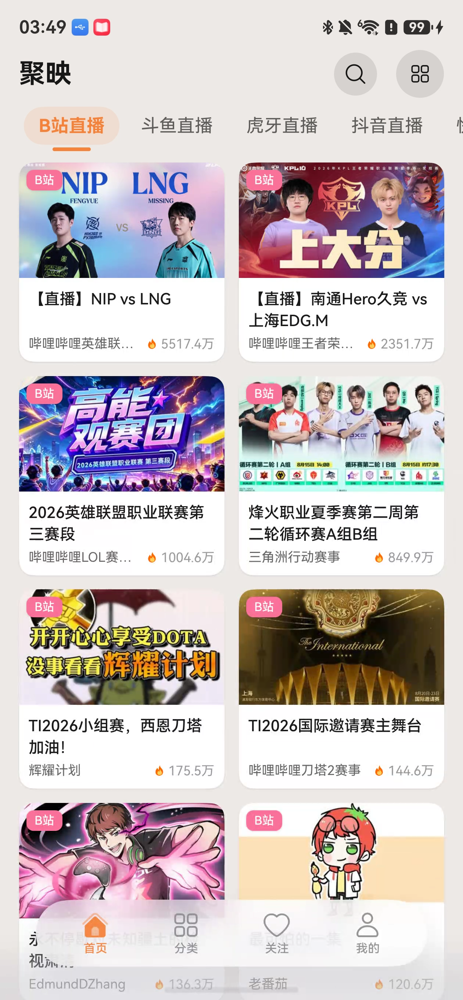
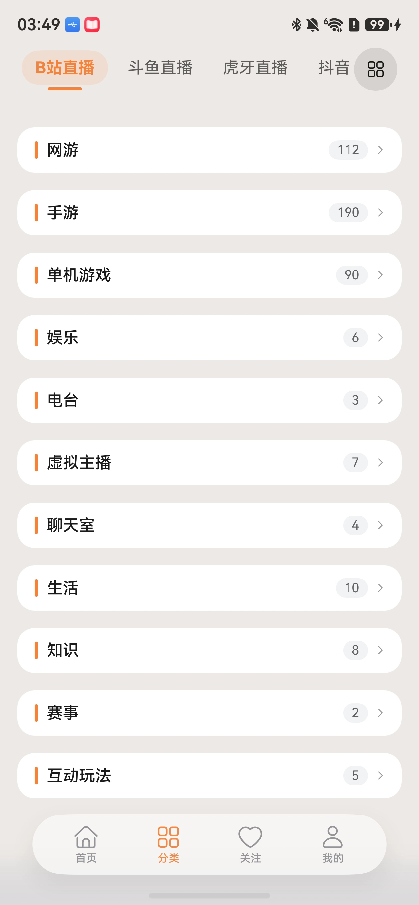
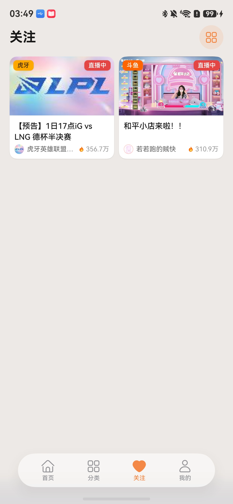
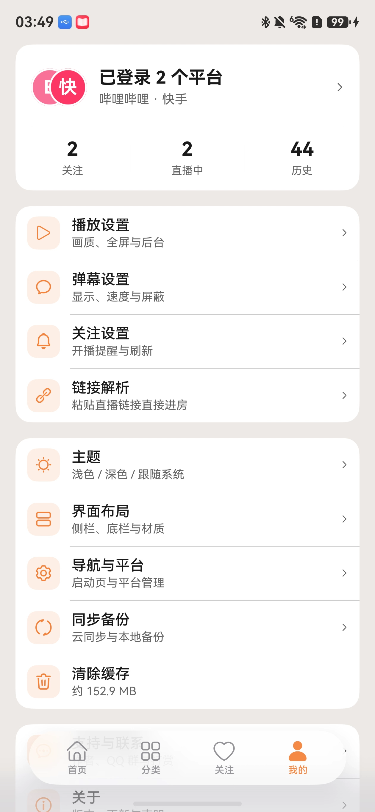
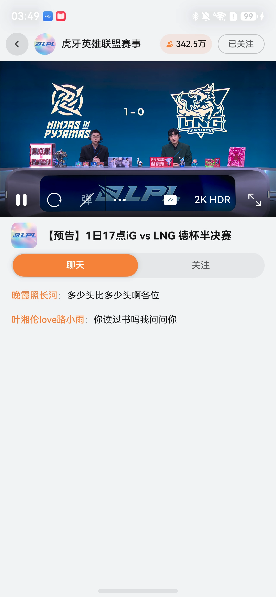
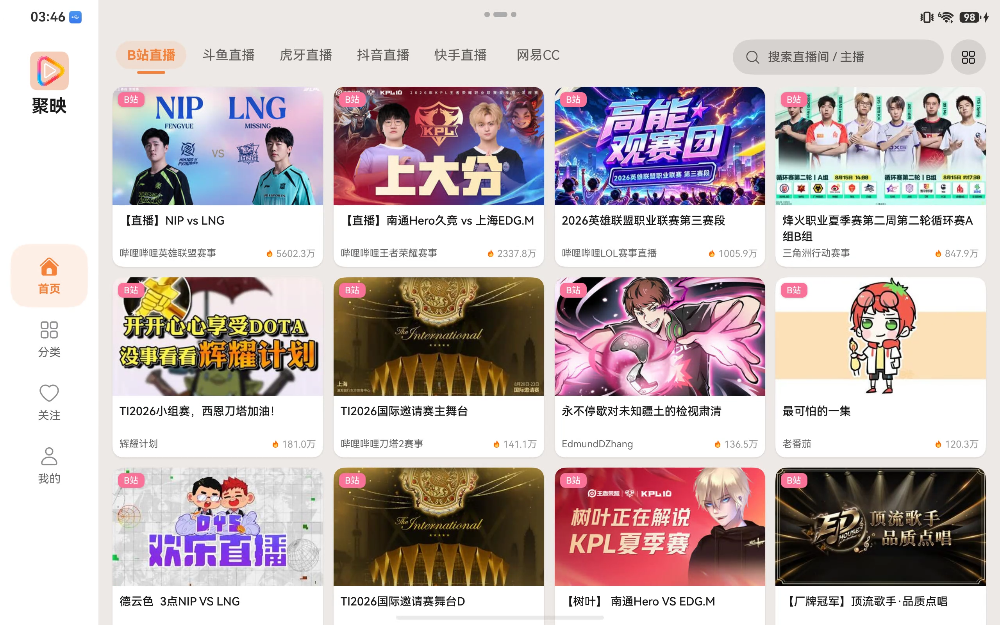
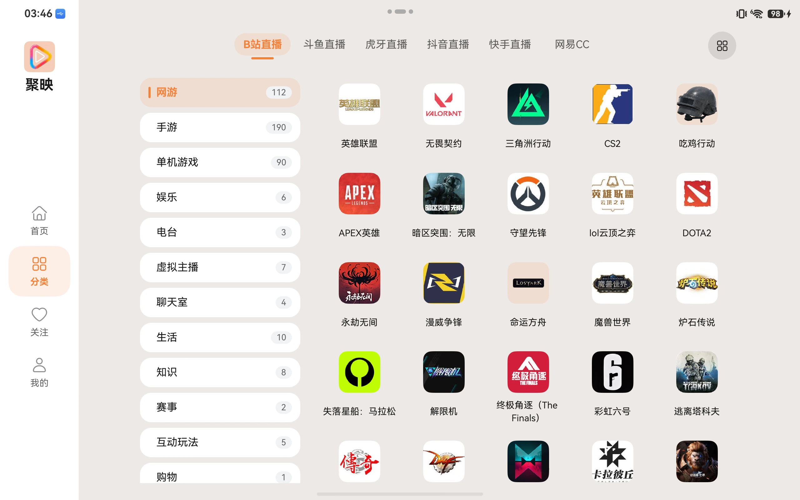
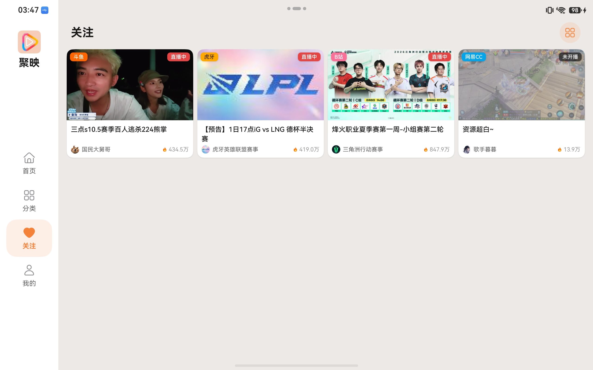
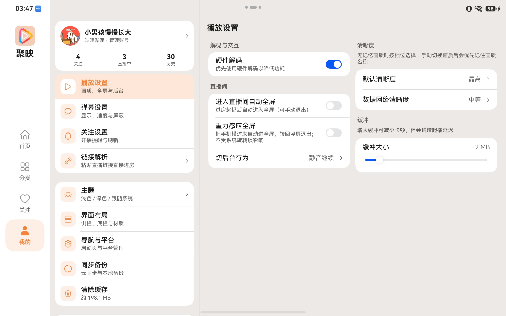
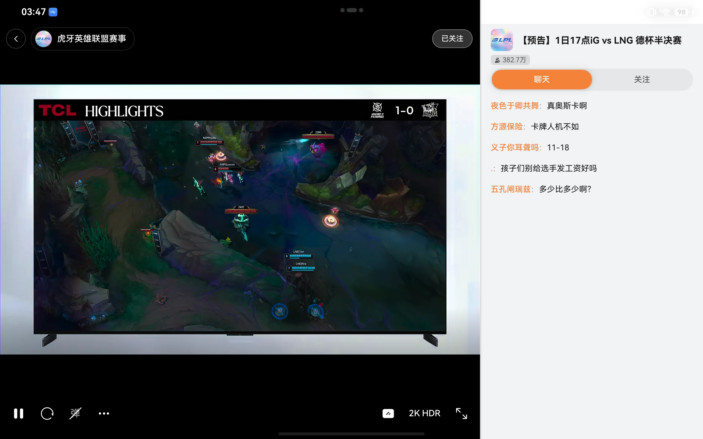

  

<h1 align="center">聚映</h1>

HarmonyOS NEXT 纯原生多平台直播聚合

  
  &nbsp;
  
  &nbsp;
  

在一个应用里观看哔哩哔哩、斗鱼、虎牙、抖音、快手、网易 CC 的公开直播，支持弹幕、关注、投屏与备份。仅供个人学习交流，与各平台官方客户端无关。

## 亮点

- **mpv 内核**：基于 libmpv 播放直播流，低延迟、多格式，画质档位（含虎牙 **2K HDR** 等）可在直播间切换
- **HDR 透传**：HDR 元数据交给系统显示链路，支持时直出；设备不支持则自动按 SDR 观看
- **硬件解码**：默认开启，更省电、更少发热
- **系统投屏**：用鸿蒙 AVCast 投到电视等设备，通知栏和耳机也能暂停 / 继续
- **一多适配**：手机底栏、平板侧栏、宽屏分栏、折叠屏避让折痕

## 功能

| 能力 | 说明 |
|---|---|
| **发现** | 六平台推荐、分类、跨平台搜索（直播间 / 主播）。粘贴链接或分享文案即可进房；哔哩哔哩、抖音、快手短链也能打开。 |
| **播放** | libmpv 内核 + 硬件解码。多画质（含 HDR 档，视平台与设备而定）；可分别指定默认清晰度和数据网络清晰度。双击进出全屏；全屏时左侧调亮度、右侧调音量。可开启自动全屏、重力感应全屏、屏幕常亮、睡眠定时。 |
| **后台与小窗** | 切后台可选继续播放、静音继续、暂停或画中画；画中画也可显示弹幕。手动打开小窗后离开页面，播放可继续。可开启「允许与其他应用同时播放」。 |
| **弹幕** | 实时弹幕。字号、透明度、速度、显示区域、描边、同屏条数、屏蔽词、弹幕合并均可调；滚动 / 顶部 / 底部可分别开关，彩色弹幕可关。哔哩哔哩醒目留言可单独展示，登录后可发弹幕。 |
| **关注与历史** | 关注主播并查看开播状态（网格 / 列表）；可开启前台开播提醒。观看历史自动记录。 |
| **账号与备份** | 哔哩哔哩支持扫码或网页登录，快手支持网页登录。收藏、历史、设置可备份到 WebDAV 或导出本地；可挑选云端历史版本恢复，也可导入旧版 Simple Live、纯粹直播备份。 |
| **外观** | 浅色 / 深色主题，默认启动页、平台顺序、底栏布局可改，可清除缓存。手机底部导航、平板侧边导航；宽屏分栏，折叠屏避开折痕。 |

## 截图

### 手机

<table>
  <tr>
    <td width="20%"></td>
    <td width="20%"></td>
    <td width="20%"></td>
    <td width="20%"></td>
    <td width="20%"></td>
  </tr>
</table>

### 平板

<table>
  <tr>
    <td width="50%"></td>
    <td width="50%"></td>
  </tr>
  <tr>
    <td width="50%"></td>
    <td width="50%"></td>
  </tr>
  <tr>
    <td colspan="2"></td>
  </tr>
</table>

## 安装

1. 到 [Releases](https://github.com/yabi-zzh/livify-ohos/releases) 下载最新安装包。
2. 推荐用 **HoKit** 侧载到 HarmonyOS NEXT 设备（我们自己的侧载工具，可完成签名与安装）：

| 端 | 下载 |
|---|---|
| 桌面（Windows / macOS / Linux） | [HoKit](https://github.com/yabi-zzh/HoKit) |
| 移动端（Android / 鸿蒙） | [HoKit-App](https://gitcode.com/yabi-zzh/HoKit-App) |

## 赞助

聚映由独立开发者维护。自愿打赏用于后续适配，不解锁任何功能。请用微信或支付宝对准下面的收款码。

  
  &nbsp;&nbsp;
  

微信 · 支付宝

## 说明

各直播平台可能随时调整接口或加强限制，部分功能会暂时不可用。完整条款以应用内「用户协议 / 免责声明」为准。
